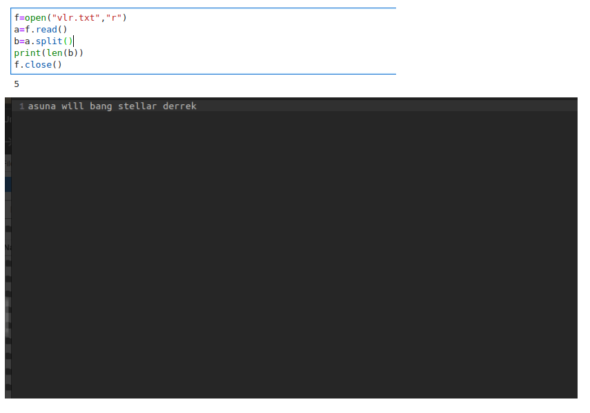

# Word-count
## AIM:
To write a python program for getting the word count from a text.
## EQUIPEMENT'S REQUIRED: 
PC
Anaconda - Python 3.7
## ALGORITHM: 
### Step 1:
Open visual studio code.
### Step 2: 
 Create file with .py extension.
### Step 3: 
Start the program.
### Step 4:  
write the code
### Step 5: 
Run terminal for output of the given program.
### Step 6: 
End the program.

## PROGRAM:
```python
Program to mark the maximum of marks using the list method sort
Developed by:Praveen
RegisterNumber: 22005917
f=open("vlr.txt","r")
a=f.read()
b=a.split()
print(len(b))
f.close()
```

### OUTPUT:



## RESULT:
Thus the program is written to find the word count from a text.
